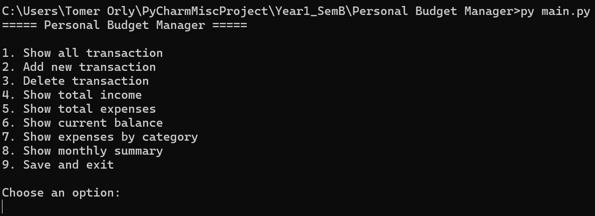
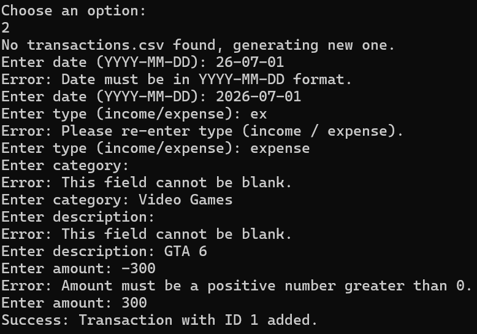
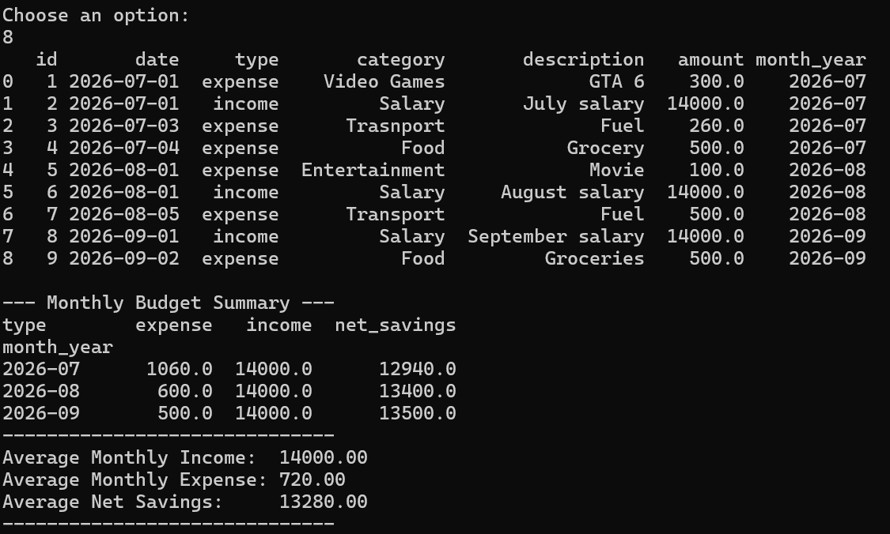
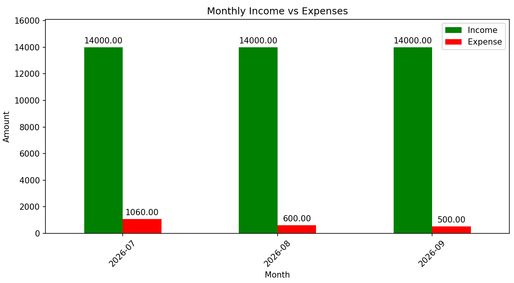

# Personal Budget Manager

## System Description
A lightweight, Command Line Interface (CLI) application built in Python to help users easily track and manage their personal finances. The system allows users to log incomes and expenses, automatically saves the data to a CSV file for persistence, and utilizes data analysis libraries to generate insightful financial summaries and visual charts.

## How to Run the Project
1. Make sure you have Python installed on your computer.
2. Install the required external libraries by running this command in your terminal/command prompt:
   ```bash
   pip install pandas matplotlib
   ```

3. Open your terminal, navigate (`cd`) to the folder containing the project files.
4. Run the main script:
```bash
python main.py
```

## Project Files

* **`main.py`**: The entry point of the application containing the interactive user menu and input validation.
* **`budget_manager.py`**: Contains the logic for reading, writing, adding, and deleting data from the CSV file.
* **`reports.py`**: Handles all data analysis, calculations, and chart generation using Pandas and Matplotlib.
* **`models.py`**: Defines the data structure for a single transaction.
* **`transactions.csv`**: The database file (auto-generated on the first run) where all financial records are stored.

## Classes Overview

* **`Transaction`** (in `models.py`): Represents a single financial record. It standardizes the data (id, date, type, category, description, amount) and includes a method to convert the object into a dictionary for easy CSV saving.
* **`BudgetManager`** (in `budget_manager.py`): Acts as the database controller. It manages the `transactions.csv` file, auto-generates sequential IDs, and safely adds or removes records.
* **`ReportGenerator`** (in `reports.py`): The analytics engine. It creates an instance of the `BudgetManager` to load the data, and then processes that data to calculate totals, filter by categories, and build visual reports.

## Pandas Reports Implemented

The project heavily utilizes the `pandas` library within the `ReportGenerator` class to process and analyze the CSV data. The implemented reports include:

1. **Total Income:** Filters the DataFrame for 'income' types and sums the amounts.
2. **Total Expenses:** Filters the DataFrame for 'expense' types and sums the amounts.
3. **Current Balance:** Calculates the net difference between the total income and total expenses.
4. **Expenses by Category:** Uses multiple conditions (masks) to filter the DataFrame by both 'expense' type and a specific user-defined category, returning the total spent in that category.
5. **Monthly Summary & Bar Chart:** Converts string dates into Pandas `datetime` objects.


* Groups the data by month/year (`dt.to_period('M')`) and transaction type.
* Uses `.unstack()` to pivot income and expenses side-by-side.
* Calculates dynamic averages using the `.mean()` function.
* Integrates with `matplotlib` to plot a visual grouped bar chart directly from the Pandas DataFrame.


## Usage Examples

### 1. Main Menu

*(The user is greeted with a 1-9 option menu to navigate the app)*



### 2. Adding a New Transaction

*(The system validates user inputs like positive amounts and valid dates, then auto-assigns an ID)*

*If the `transactions.csv` database file is missing (like on the very first run), the system automatically notifies the user and generates a fresh file to prevent the program from crashing.*



### 3. Viewing the Monthly Summary

*(The system outputs a formatted text table of monthly stats and pops up a visual bar chart)*




